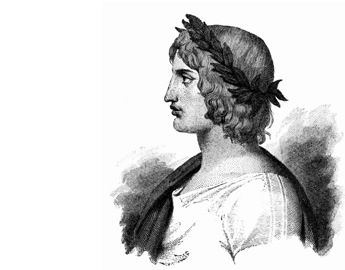

# [Virgilio Data Science](https://virgili0.github.io/Virgilio/)

Virgilio is an **open-source initiative**, aiming to **mentor and guide** anyone in the world of the **Data Science**.
Our vision is to give *everyone* the chance to get involved in this field, **get self-started** as a practitioner, **gain new skills** and **learn to navigate** through the infinite web of resources and find the ones useful for *you*.

[Find me](https://twitter.com/giac290595) on Twitter to have a chat!

## -----> [**Meet Virgilio now!**](https://virgili0.github.io/Virgilio/)
 

### Table of Contents

- [What is Virgilio](#what-is-virgilio)
- [About](#About)
  * [License](#license)
  * [Contribute](#contribute)

# What is Virgilio?

Studying and reading through the Internet means swimming in an **infinite jungle of chaotic information**, even more so in rapidly changing innovative fields. 

_Have you ever felt overwhelmed_ when trying to approach **Data Science** without a real “path” to follow? 

Are you tired of clicking “Run”, “Run”, “Run”.. on a Jupyter Notebook, with that false sense of confidence given by the comfort zone of the work of others?

Have you ever got confused because of the several and contradicting names for the same algorithm or approach, from different websites and fragmented tutorials? 

**Virgilio addresses these critical issues for free, for everyone.**

## [**Enter in the new web version of Virgilio!**](https://virgili0.github.io/Virgilio/)

## About

Virgilio is developed and maintained by [these awesome people](docs/contributors.md).
[Find me](https://twitter.com/giac290595) on Twitter to have a chat!

### Contribute

That's awesome! Check the [contribution guidelines](docs/contributing.md) and get involved in our project!

### License

Contents are released under the Creative Commons BY-NC-SA 4.0 [license](https://github.com/virgili0/Virgilio/blob/dev/LICENSE). Code is released under the [MIT license](https://github.com/virgili0/Virgilio/blob/dev/.vuepress/LICENSE).
The Virgilio image comes from [here](https://upload.wikimedia.org/wikipedia/commons/c/ce/Virgil_.jpg).
