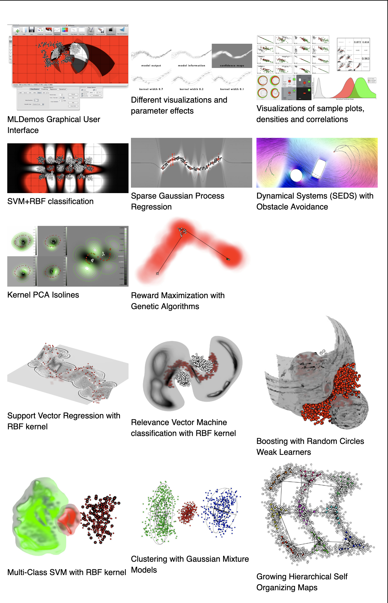

# MLDemos

[MLDemos](http://mldemos.b4silio.com/) is an open-source visualization tool for machine learning algorithms created to help studying and understanding how several algorithms function and how their parameters affect and modify the results in problems of classification, regression, clustering, dimensionality reduction, dynamical systems and reward maximization.

MLDemos is open-source and free for personal and academic use.


## Install

### Binary Packages

#### Legalities  

The packages contain binary versions of a number of opensource libraries. I am including them here with the knowledge that this might not be entirely compatible with the distribution policies of each respective library. I will try to contact and get the necessary permissions, to the extent to which this is possible, from the related parties. In the meantime, I distribute this software in good faith, my goal is for people to be able to study and work with the different methods implemented here. See the acknowledgements section below for a list of the people who contributed.
You are free to use this software for personal and educational purposes, you are not allowed to use it for commercial purposes. You can redistribute the software as long as you provide a link to this page. Then again, this page will always link to the latest version of the software so you may be better off taking the version here anyway.

### Source Code

The MLDemos source code can be obtained directly via git or from the public repository (get the *devel* branch for the latest release)

```sh
git clone git://gitorious.org/mldemos/mldemos.git -b devel
```

[public GitHub repository](https://github.com/b4silio/MLDemos)
[source_backup](http://mldemos.b4silio.com/MLDemos-0.3.0-source.zip) (0.3.0)

#### **Requirements**

The code requires Qt (5.10) and (in part) OpenCV (3.1) and Boost (1.47). Previous versions of these libraries might work as well but you might as well use the newer version. Be sure to adjust your include and lib paths to point them to the correct directories.

The software was compiled and tested on Mac OSX High Sierra, Windows 10, Gentoo, Ubuntu and Kubuntu 10.04, using QtCreator 2.1 and 2.6.

* Windows
In order to compile MLDemos in windows, you will need MinGW (commonly installed with the QtSDK for MinGW.

* Debian
Prof. Barak A. Pearlmutter has created a debian package, which will be available soon. In the meantime you can build it following the instruction below:

```sh
git clone git://github.com/barak/mldemos.git
cd mldemos
git checkout debian
dpkg-checkbuilddeps
fakeroot debian/rules binary
sudo dpkg --install ../mldemos_*.deb
```

> Note: OpenCV 2.4 is not available directly (only 2.1 is), which will require you to build OpenCV2.4\. This is only necessary to use MLP and Boosting. These are two important algorithms, so you might as well make the effort:

```sh
git clone git://github.com/barak/opencv.git
cd opencv
git checkout master
dpkg-checkbuilddeps
fakeroot debian/rules binary
sudo dpkg --install ../*opencv*.deb
```

Again, a huge thanks to Barak!

### **Known Bugs**

* WINDOWS: Clearing the canvas while in the 3D display leaves part of the memory occupied, which can accumulate when this is done several times (part of a memory bug on Windows only)
* LINUX (CDE package) loading and saving of external files does not work
* Approximate KNN classification creates weird blank spaces on some machines and with some metrics.
* Saving does not work on the linux CDE package
* Resizing the canvas when a reward map has been drawn does not update the underlying data (avoid doing it).
* In Boosting, changing the data does not recompute the learners, which can lead to bad results if the data has changed boundaries significantly

### **What's New** [Changelog](http://mldemos.b4silio.com/changelog.txt)

v0.5.0

### *New Visualization and Dataset Features*

* *Added 3D visualization of samples and classification, regression and maximization results*
* *Added Visualization panel with individual plots, correlations, density, etc.*
* *Added Editing tools to drag/magnet data, change class, increase or decrease dimensions of the dataset*
* *Added categorical dimensions (indexed dimensions with non-numerical values)*
* *Added Dataset Editing panel to swap, delete and rename dimensions, classes or categorical values*
* *Several bug-fixes for display, import/**export** of data, classification performance*

### *New Algorithms and methodologies*

* *Added Grid-Search panel for batch-testing ranges of values for up to two parameters at a time*

* *Added One-vs-All multi-class classification for non-multi-class algorithms*

* *Trained models can now be kept and tested on new data (training on one dataset, testing on another)*

* *Added Automatic Relevance Determination for SVM with RBF kernel (Thanks to Ashwini Shukla!)*

* *Added Growing Hierarchical Self Organizing Maps (original code by Michael Dittenbach)*

* *Added Random Forest classification*

* *Added LDA as a classifier (in addition to projector)*

* *Added Save/Load Model option for GMMs and SVMs*

## Screenshots



## Algorithms

### Implemented Methods

#### **Classification**

* Support Vector Machine (SVM) (C, nu, Pegasos)
* Relevance Vector Machine (RVM)
* Gaussian Mixture Models (GMM)
* Multi-Layer Perceptron + BackPropagation
* Gentle AdaBoost + Naive Bayes
* Approximate K-Nearest Neighbors (KNN)
* Gaussian Process Classification (GP)
* Random Forests

#### **Regression**

* Support Vector Regression (SVR)
* Relevance Vector Regression (RVR)
* Gaussian Mixture Regression (GMR)
* MLP + BackProp
* Approximate KNN
* Gaussian Process Regression (GPR)
* Sparse Optimized Gaussian Processes (SOGP)
* Locally Weighed Scatterplot Smoothing (LOWESS)
* Locally Weighed Projection Regression (LWPR)

#### **Dynamical Systems**

* GMM+GMR
* LWPR
* SVR
* SEDS
* SOGP (Slow!)
* MLP
* KNN
* Augmented-SVM (ASVM)

#### **Clustering**

* K-Means
* Soft K-Means
* Kernel K-Means
* K-Means++
* GMM
* One Class SVM
* FLAME
* DBSCAN

#### **Projections**

* Principal Component Analysis (PCA)
* Kernel PCA
* Independent Component Analysis (ICA)
* Canonical Correlation Analysis (CCA)
* Linear Discriminant Analysis (LDA)
* Fisher Linear Discriminant
* EigenFaces to 2D (using PCA)

#### **Reward Maximization** *(Reinforcement Learning)*

* Random Search
* Random Walk
* PoWER
* Genetic Algorithms (GA)
* Particle Swarm Optimization
* Particle Filters
* Donut
* Gradient-Free Methods (nlopt)

### Contributing

If you are developing a new algorithm that could fit into the MLDemos framework and would like to see it integrated into the software, please get in contact (see info below) and describe what type of help you require for the implementation of a MLDemos plugin.

### Acknowledgements

This program would not exist if a number of people had not put a lot of effort into implementing the different algorithms that are combined here into a single program.

* Florent D'Hallouin (GMM + GMR) - [LASA](http://lasa.epfl.ch/)
* Dan Grollman (SOGP) - [LASA](http://lasa.epfl.ch/)
* Mohammad Khansari (SEDS + DSAvoid) - [LASA](http://lasa.epfl.ch/)
* Ashwini Shukla (ASVM, ARD Kernels) - [LASA](http://lasa.epfl.ch/)
* Stephane Magnenat (ESMLR) - [website](http://stephane.magnenat.net/)
* Chih-Chung Chang and Chih-Jen Lin (libSVM) - [website](http://www.csie.ntu.edu.tw/~cjlin/libsvm/)
* David Mount and Sunik Arya (ANN library) - [website](http://www.cs.umd.edu/~mount/ANN/)
* Davis E. King (DLIB) - [website](http://dlib.net/)
* Stefan Klanke and Sethu Vijayakumar (LWPR) - [website](http://www.ipab.inf.ed.ac.uk/slmc/software/lwpr/)
* Robert Davies (Newmat) - [website](http://www.robertnz.net/nm_intro.htm)
* JF Cardoso (ICA) - [website](http://www.tsi.enst.fr/icacentral/algos.html)
* Steven G. Johnson (NLOpt) - [website](http://ab-initio.mit.edu/wiki/index.php/NLopt)
* The WillowGarage crowd (OpenCV) - [website](http://opencv.org/)
* Trolltech/Nokia/Digia (Qt) - [website](http://qt.digia.com/)
* The authors of several of the icons - [website](http://www.iconeasy.com/)
* The PhD students following the 2012 ML class at EPFL (Julien Eberle, Pierre-Antoine Sondag, Guillaume deChambrier, Klas Kronander, Renaud Richardet, Raphael Ullman)

Moreover, the program itself would be far less performant without the work of the support and development team at LASA: Christophe Paccolat, Nicolas Sommer and Otpal Vittoz.

Thanks also to the people who have not contributed code but have contributed no less directly: Aude Billard, for being one of the best bosses one could wish for, François Fleuret, for a bunch of fruitful discussions, and the AML 2010,  and 2011 classes for patiently giving it a first test-drive.

## quick start

### Very quick start

1. Launch the software
1. Draw samples by clicking either the left or right mouse button.
    1. left-click generates samples of class 0
    1. right-click generates samples of the class selected in the toolbar (default: 1)
1. Select the Display Options icon
    1. this will allow you to display model information, confidence/likelihood maps and to hide the original samples
    1. the mouse wheel will allow you to zoom in and out
    1. alt+dragging will allow you to pan around the space
1. Select the Algorithms Options icon
1. Select one of the algorithm icons to open their respective option panels
1. Click the Classify button to run the algorithm on the current data

### Importing data

Generating data in MLDemos is done in three different ways: by manually drawing samples, by projecting image data through PCA (via the PCAFaces plugin), or by loading external data.

Comma separated values, or other text-file based value tables can be drag-and-dropped into the interface. In this case a Data Loading dialog will appear to allow choosing which columns or rows should loaded, interpreted as class labels or headers, etc.

Alternatively, a native data format used by the software is ascii-based and contains:

1. The # of samples followed by # of dimensions
1. For each sample, one line containing
    1. The sample values space-separated (float, one per each dimension)
    1. The sample class index (integer 0 ... 255)
    1. A flag value (integer 0-3) to terminate the line (unused for the time being)

A simple example would be

```code
4 3
0.10 0.11 0.12 0 0
0.14 0.91 0.11 0 0
0.43 0.74 0.41 1 0
0.28 0.34 0.33 1 0
```

which presents 4 three-dimensional samples, two from class 0 and one from class 1.

When the file is saved from MLDemos, the software adds the current algorithm parameters (provided an algorithm was selected), which can be useful for demonstration purposes. If no such information is present, the default algorithm parameters are selected.

Drawing manually some samples, or importing a standard dataset and saving it from within MLDemos should give you ample examples on the file syntax.

------------
Created by Dr. Basilio Noris at the [Learning Algorithms and Systems Laboratory](http://lasa.epfl.ch/)

Expanded upon by the editor of the [iOSDevLog Blog](http://iosdevlog.com/), [jiaxianhua](https://github.com/iOSDevLog)