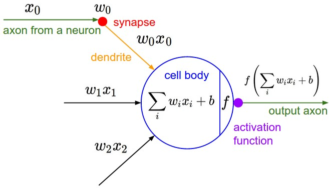
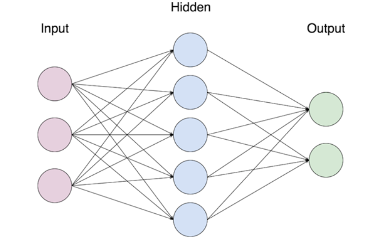

### Deep Learning
To deal with problems of great complexity, such as the recognition of images or the understanding of human language, mathematical models that approximately known functions are often insufficient (underfitting problem). The expression "Deep Learning" was used for the first time when talking about Artificial Neural Networks (ANNs) by Igor Aizenberg and colleagues in 2000, although already in the 1970s prototypes of representation of Artificial Neurons were designed, but they needed computational power to be trained and had major limitations in practical terms. The term Deep learning implies the use of neural networks (we'll soon see what they are) that have various "levels" of depth, and are therefore called "deep". In the last few years, they are becoming more and more important because they can manage extremely complex tasks, such as the classification of videos (frame by frame), the recognition of objects in a photograph, the understanding of human language in multiple languages. Every system of user customization of large platforms (Amazon, Netflix, Google, LinkedIn...) is Saturday on huge deep neural networks (even tens of millions of parameters) that can handle all the complexity given, for example, by the catalog of Netflix, which contains tens of thousands of titles and tries to figure out which is the most suitable for the user, based on everything he has seen before, what he saw recently, the time of day, or many other factors!

### Neural networks
## Introduction and connections with biology
What is a neural network? A neural network is a component of an ML system (usually the Deep Learning sub-module) that has a large number of parameters (called weights) that are progressively adjusted during the training process, trying to achieve an effective representation of the data they process, so you can generalize well on new cases that will be presented to you. It is called in this way because it emulates the structure of the biological brain, in which neurons exchange electrochemical impulses through the synapses, generating as a whole the representations and thoughts that the outside world stimulates in our mind. For example, if we see the image of a horse, the neurons of sight (a particular type of neurons placed in the part of the cerebral cortex called the visual cortex) are activated and send electrical impulses according to the scheme that, in our memory, is connected to the thought "I am seeing a horse". Even if we look away, in the short term we are very clear about the image we have just seen, and this happens thanks to the fact that the neurons and synapses constantly collaborate with memory and previous experiences to provide us with perception as realistic and solid as possible of reality. The patterns according to which neurons work are mostly patterns that we cannot understand, even if we see daily efforts in this direction both by neurobiologists and in various transversal fields. 

 

During growth, the individual's brain grows and develops its connections thanks to the sensory experiences we live (the concept of neuroplasticity, which allows our body to build neurons and connections throughout life). Every time we have a sensory experience or learn something new (like tying our shoes as children) our brain strengthens a part of the neurons and especially their connections. In a certain sense, wanting to slightly force the biological analogy, it may be useful to imagine all the experiences we have lived up to this moment (visual, tactile, emotional...) as a huge "training set" on which our network of neurons in the brain is shaped and changes continuously, trying to represent reality in the most sensible way possible to allow us to make conscious choices that aim at the safety of the individual (and a successful reproduction!).
For example, when for the first time as children we interact with fire and we get burned, we could say that by simplifying extremely, this happens at a high level:
1 Our brain completes the sequence "I recognize a flame" -> "I touch it with my finger".
2 The event is "labeled" as bad (the pain we feel).
3 The brain takes these two pieces of information (a datum and its label) as input and tries to understand what sequences of neurons were activated when I recognized a flame.
4 The brain "updates" its structure (building new neurons, synapses and swelling existing ones) to improve and learn not to repeat the action. 
Simplifying as much as possible, it's as if the brain "chained" the concept of "burning" to the sequence of "I see a flame" -> "I touch it with my skin".
5 The next time the brain sees a flame, the series of neurons that the brain had set up to "learn not to burn" is activated and by collaborating with the amygdala (where our memory resides) it saves us from the new danger.

## Single neuron as a classifier
The process we have just seen (learning not to touch the fire) contains some key elements that have inspired the design of neural networks used today. We'll see in the next chapters how artificial neural nets take labeled data (we could call them "facts") as input, try to understand how each neuron has weighed on a correct or incorrect attempt at classification, and try to "ambush the shot", later, modifying them slightly.
Artificial neurons are made up as follows: they have a central "body" (represented by a number), an output activation function that "decides" whether that neuron will communicate with the neurons to which it is connected (or will activate itself), and a series of inputs from other neurons that from time to time contribute to the activation or not of the individual neuron. An artificial neuron then takes as input a series of inputs (the outputs of previous neurons), adds these values and combines them with its current value, and if this calculation reaches a certain threshold the neuron is activated, applying its activation function to the calculation just made and propagating it forward towards the neurons "downstream" from it. We can imagine that the activation function "shoots forward" (feed-forward pass) if the sum of its inputs is greater than 0.5 and that it does not do so otherwise. In this case, we can train the neuron to take the input and classify it in two different cases depending on whether it is active or not (binary classification). 
In the image: x0 is the input received from another neuron, w0 is the connection between that neuron and the current one.
F is the activation function of the neuron (there are several used in practice) and is applied on the internal calculation of the neuron if it reaches the chosen activation threshold.
To encode the concept of "activation threshold" we use a number called bias that acts as an offset to be added to the activation calculation (b in the image).

 

## Introduction to neural networks
In practice, a single artificial neuron is useless in solving problems, because it is too simple a model. But by structuring many copies of this neuron into hierarchical levels, complex structures can be created that are able, for example, to capture the complexity of an image and classify it. The term neural network refers to a series of neurons connected together in an acyclic graph, organized into layers. The most basic layer is made up of a certain number of neurons that are connected to all the neurons of the next layer (but not to the neurons on the same layer) and is called fully-connected layer. A neural network that has at least one layer in addition to input and output is called a deep neural network, where the hidden layers are the internal ones.

 

In the image, the network has an input layer with 3 neurons, a hidden layer with 4, and an out with 2 (binary classification). In this case the network has, without counting the inputs, [3 x 5]+[5 x 2] + 5 (bias hidden) + 2 (bias output) = 27 modifiable parameters. Modern networks with hundreds of millions of parameters are organized in approximately 15-25 levels. 
Another name used for multi-layer neural networks is MPL (Multi-Layer Perceptron).
This kind of neural network is called a feed-forward neural network because the data is only propagated "forward". There are other types of networks (RNN) whose neurons instead see the passage of the same data several times, and implement the concept of "memory" of the network. These are widely used in the recognition of human language, where subjects change from sentence to sentence, but often the context remains the same and must be "remembered" by the network as new sentences are interpreted. 

Hopefully you're now familiar with the concept of Artificial Neural Network. In the next high level guides we'll see how to build and train this kind of network to tackle classification problems.

If you like Virgil's content and share our vision of open education accessible to all, share and register in the Google Form, you'll be updated every time a new guide comes out! 

------------------

Written by _clone95_

