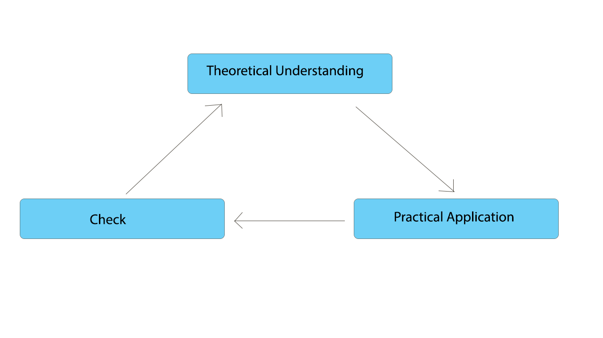

# The Art of Learning

# What you will learn 
This guide serves various purposes: 

- To understand broadly how the learning of the human brain works (before teaching machines, we will have to learn to 
learn ourselves, right?).
- Presenting _how_ Virgilio sees teaching and learning.
- Give useful tips to make the most of the help Virgilio can give you in starting to explore this fantastic world, 
and develop solid skills in the world of data through practical projects.

The guide is built using these relevant materials as well as the personal experiences of the author, who has spent a good amount of time documenting and testing techniques and approaches, both on himself and as a teacher.

## Prerequisites
It is recommended to read all the Paradise guides prior to this one.

## Time to complete
30 minutes.

# Index
- [The Art of War](#The-Art-of-War)
- [The Art of Learning](#The-Art-of-Learning)
- [Mastering Internet](#Mastering-Google)
- [Practice for Success](Practice-for-Success)
- [The Magic Box](The-Magic-Box) 
- [Time Management](#Time-Management)
- [Suggested Readings](#Suggested-Readings)

### The Art of War

This guide is aimed at anyone who wants to enter the world of innovative fields such as those covered by Virgilio, but it can serve as a general approach to learning any subject, skill or job.

For this guide we will use various enlightening books (famous and not), from which we will draw various lessons about how human beings learn, create, reason and memorize.

For each resource, summaries or "key points" will be provided, but I will never stress enough the importance of reading the books that will be mentioned.

The first book we consider is [The art of War](https://www.amazon.it/Art-War-Sun-tzu/dp/1936276011). 

[Here](https://sites.ualberta.ca/~enoch/Readings/The_Art_Of_War.pdf) you have a more consensual version, but I recommend buying the book with the attached analyses.

[Here](http://blog.tutorming.com/expats/life-lessons-from-the-art-of-war) the main key points.

The book is a condensed of the wisdom of various generals and heads of state of the ancient Chinese empire, and is used in many training courses, especially in management and decision making.

I firmly believe that its principles can apply to any human activity, particularly the planning of one's own self-improvement and learning. 

Today you don't learn a job that you will do all your life, but you will have to re-invent yourself and learn new skills continuously. [**Who stops is lost!**](https://www.mckinsey.com/featured-insights/future-of-work/ai-automation-and-the-future-of-work-ten-things-to-solve-for)

The two main points of instruction that I would like to emphasise are:
- Know your enemy
>“If you know the enemy and know yourself, you need not fear the result of a hundred battles. If you know yourself but not the enemy, for every victory gained you will also suffer a defeat. If you know neither the enemy nor yourself, you will succumb in every battle.”

This means that whenever you are faced with a problem, be it an enemy soldier, an engineering problem, or a human relationship, the best tactic is to know your enemy as much as possible. 

Continuing the analogy, knowing the enemy means knowing the number of his forces, how his army is composed, which are the most important departments.

In our case, it means knowing how much work awaits us, what is the perimeter of the things we want to learn, and what are the techniques most used in practice. 

If you try to do everything, you do nothing! Which brings us to the next point:

- Face one enemy at a time

How many tutorials have you seen of the type "learn Data Science" in 3 weeks, full of many topics and concepts, techniques and frameworks? This approach is totally unsuccessful (as well as disrespectful for those who take years and years of study), the reason is trivial. 

What we at Virgilio prefer to do is to outline a path that enables you to **take one step at a time**, learn one concept and apply it, preferring _a solid skill_ (developed in the right time) rather than knowing a thousand acronyms or exotic techniques.

This principle is another way of formulating the classic [**Divide et Impera**](https://en.wikipedia.org/wiki/Divide_and_rule_and_rule), a principle of software engineering whose purpose is to try to manage the growing complexity of programs, as well as generally advise to disassemble a problem into smaller pieces and address them separately. 

In a later section we will see how the principles of software engineering, dealing with complexity and logic, can be applied profitably to everyday life, rational thinking, and in general to the planning of our lives (professional and non-professional).

We'll help you to develop you "The Art of Learning".

### The Art of Learning

The human brain is currently the most complex device we know of, far more complex and powerful than any result of today's engineering. In addition to this, it is also extremely efficient in terms of the resources required for operation, gives us the feeling of being "living" and protects us from the outside world in an ingenious way. What an incredible thing!

To exploit it to its full potential, however, is very difficult, firstly because [we know very little](https://www.reddit.com/r/MachineLearning/comments/9symfk/d_reverseengineering_a_massive_neural_network/) about its operation, and secondly because we are not taught to do so!

The good news is that countless scientists for decades have been looking for clues on how to learn best, and effective techniques have been developed that work more or less for everyone.

[Here](https://examinedexistence.com/top-10-learning-techniques-ranking-from-best-to-worst/) is an overview of these techniques.

The bottom line is that each brain is different, according to [the experiences it has lived and how it has formed](https://learn.genetics.utah.edu/content/epigenetics/brain/).

So, understanding which learning strategies work best **for you** is something to discover, more like a trip, than something you can learn from a book or a course.

The latter are extremely useful for not having to reinvent the wheel, and understand what options work, but then you have to experiment and fail to understand what is the most suitable technique in your case.

Before you even start learning, you have to learn to learn! 

Virgil's suggestion is: spend time testing different learning strategies, each for at least a few topics, and evaluate the results! 

If you don't want to and want to focus on the subjects you want to learn right away, we offer you a technique that suits more or less all situations and all brains.

Actually it's nothing particularly innovative, but to be cool we'll call our _learning framework_ "The Magic Circle".

The Magic Circle is a **iterative** process that consists of 3 simple steps:

- Theoretical understanding
- Practical application
- Check in

 

The trick is simple. 

**By addressing one topic at a time**, you first aim for a theoretical understanding, then you put it into practice, and finally you evaluate yourself. If you feel confident you can proceed, otherwise you will iterate another round of the circle. 

Some advice: 
- The first time you address the topic X, first of all make sure you have **framed** X. In Sun Tzu this means knowing how your enemy's army is made up. You don't need to know in detail which men make up its ranks, but you need to have an overview of how many forces it has and how they are divided. In our case it means knowing **why** I'm learning this, **what prerequisites** it has, and **where it fits** in with the neighboring topics. 
Every Virgilio guide provides this kind of information, but it is important to spend time looking for it and understanding alternative points of view. 

- Each different iteration of the Magic Circle tries to change the resources you use to support learning. Virgilio's guides often provide more resources for the same topic, just to get more visions of the same concept.

- The point just mentioned is fundamental. Knowledge is multifaceted, and there are many different ways of seeing or understanding almost everything. An incredible trick to fully know a topic or concept is to see it under as many different points of view as possible, see alternative interpretations, or alternative methods of visualization. 
It is very important to confront also those who claim that a certain concept is useless, harmful or outdated! For example, if I'm learning what a neural network is, it's also very useful to look for information like "when not to use a neural network".

- For each topic, Google searches for visualizations of concepts, GIFs, videos, in short, any form of explanation that goes beyond words and code examples.

- Don't persist too much on a subject, it's natural that after a while you lose interest and motivation (especially if they are difficult or advanced concepts). Relax with some simple new concepts, and maybe come back to this in a few days or weeks. The connections of our brain in fact take time to form and strengthen, do not stress it too much! :)

**These are some of the best practices that are dictated partly by common sense, partly by what international research says and partly by the personal experiences of the author of this guide.**

Let's now see how to use the tools you have at your disposal (in addition to your partner Virgil), to enhance your learning and make it unlimited.

### Mastering Internet
