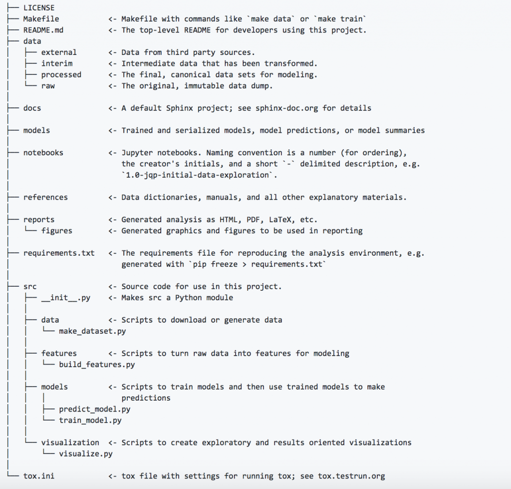

# Index
- [Collect Information](#Hunting-for-Information)
- [Building a Knowledge Tree](#Building-a-Knowledge-Tree)
- [Choosing a Project Structure](#Choosing-a-Project-Structure)
- [Reproducibility](#Reproducibility)
- [Versioning](#Versioning)
- [Documentation](#Documentation)

Let's dive right in!
 
 
## Collect Information
A vital phase when starting a project is to search for information that can help you. These can be of any kind:
- Tutorials
- Documentation
- Existing projects
- Research Papers
- ...

This guide will not teach you how to use [Google](https://www.google.com/), because you will already know if you are reading these lines :D 

By the way, probably not everyone knows about [**these Google tricks**](https://smallbiztrends.com/2019/03/google-tricks.html)...

But there are a few tips that can come in handy when you start "amassing" knowledge that will then come in handy.

In this guide, we'll make heavy use of a collection of awesome best practices from the [PLOS | Public Library of Science](https://www.plos.org/). 

Do you know the joy when you find a _giant diamond cluster in Minecraft_? 

If yes, you need to know that you've just hit a big one:
take your time to explore the [**Ten Rules Collection**](https://collections.plos.org/ten-simple-rules).

### Understand what you're looking for

The first thing to do when dealing with a new problem is to make sure you're looking for the right things. Are you sure the problem is called that for example? Image segmentation is different from image classification! [This Google guide](https://developers.google.com/machine-learning/problem-framing/cases) can help you be sure of the name of your problem.

This may seem trivial, but many useful resources are not found because the correct keywords are not typed into the search engine.

Consider the use of the [5 Whys technique](https://en.wikipedia.org/wiki/Five_whys) to better understand the problem you're trying to solve.

### Don't re-invent the wheel
Are you sure that someone hasn't already solved your problem? In that case, if you needed it to solve a real problem you'd already have the dish ready, while if you're doing it to learn you have a base from which to start! Also, observing the code of others is very effective for learning.
In the latter case, it is still advisable to try to re-implement the solution.

To look if someone has solved the same problem the first place to look is [Github](https://github.com/), the platform where every developer puts Open Source code. 
Another interesting place can be [Kaggle](https://www.kaggle.com/), the site of the Data Science challenges, where thousands of practitioners and experts challenge each other on real problems, and whose works are available in the form of Notebooks.

Let's suppose for example that I want to solve a problem related to time series: I can type on Kaggle "analysis of time series" and I will probably find dozens of Notebooks that show how to solve a similar problem, and from which you can observe the approach. What a great source of inspiration!

Also check out [TensorFlow Hub](https://www.tensorflow.org/hub), [ModelZoo](https://modelzoo.co/) and [Papers with Code](https://paperswithcode.com/). These three platforms are full of pre-trained models that can come in handy, or even solve your problem already! :) 

### Find communities
Join communities of people interested in the topic (e.g. [Reddit](https://www.reddit.com)): here you can find discussions, search by keywords (e.g. "time series analysis"), and ask questions, with experts who will answer and help you. 

Try to form specific, well-written questions, to minimize the time used by the respondent. For example, the question "how do I analyze a time series?" is too general, and a short Google search is all it takes to get the answer. 

Instead, a question like "to analyze a time series and train a model that predicts 2 steps forward in the future, is it better to approach X or approach Y?".

If the questions are too general or show laziness they'll likely remain unanswered...

Some subreddits you can subscribe to are:

- [r/MachineLearning](https://www.reddit.com/r/MachineLearning/)
- [r/LearnMachineLearning](https://www.reddit.com/r/learnmachinelearning/)
- [r/DeepLearning](https://www.reddit.com/r/deeplearning/)
- [r/DataScience](https://www.reddit.com/r/datascience/)
- [r/LearnDataScience](https://www.reddit.com/r/learndatascience/)

Two other good places to post (well structured) questions are:
- [HackerNews](https://news.ycombinator.com/)
- [Quora](https://www.quora.com/)

## Building a Knowledge Tree

Given the speed of scientific research in the world of data, every day a new approach to your problem could be discovered that proposes a much better solution than the previous one. The only way to get up to date is to read research papers! 

_Reading papers is difficult though, they are often full of mathematical, and statistical concepts, with complex theories._ The important thing, however, is to be able to understand the concepts, and maybe try to apply them to your problem. 

Also often remember that [Papers With Code](https://paperswithcode.com/) collects the code to implement (almost) any paper! 

Often already after a couple of days from the release, there is code available in various frameworks, ready to be tried on your problem. 

However, when you are confronted for the first time with a new problem _you do not know which paper to start with_, also because usually, the papers refer to all previous papers that have tried to solve the same problem, and assume that the reader has some kind of knowledge about the problem.

So what to do?

Use the **Papers Tree strategy**:

- Find the last survey paper about the sub-field of Data Science you're trying to solve 
- Read carefully this paper, and understand which are the foundations and try to figure out which are the most important papers the sub-field is based on. Usually, the history of the field is covered, citing the most important papers, and this gives you an overview of which were the important steps of the research, up to the state of the art in the approach to the problem.

Following the example above, this paper -> [A Survey of the Recent Architectures of Deep Convolutional Neural Networks](https://arxiv.org/abs/1901.06032) contains a detailed map of the most important papers on **convolutional neural networks** (neural networks that work well with images and videos) and their evolutions, up to the most advanced architectures. 

Now you just have to look for the most important (or interesting) papers mentioned, organized in a time-aware tree!

A good practice is to use [Zotero](https://www.zotero.org/), a document manager that allows you to keep track of all your research papers.

You can then repeat this process in a more specific way, for example by looking for a survey paper on convolutional networks applied to the diagnosis of medical images. 

Once you collected the most important papers for your research, document your exploration!

Tools like [MindMup](https://www.mindmup.com/) can help you in this task. 

Consider the [Rhizomaps](http://spdrdng.com/posts/rhizomapping-rhizomaps-rhizomatic-learning-mindmapping-speed-reading-tip-17-take-notes-with-mindmaps-and-rhizomaps) approach too, it really helps in dumping our thoughts on paper.


::: warning
Before reading any paper [**read this!**](https://web.stanford.edu/class/ee384m/Handouts/HowtoReadPaper.pdf)
:::

It's a paper that explains how to read a paper. **Yes, Virgilio loves recursion.**

## Choosing a Project Structure
Choosing a project structure is vital to managing the complexities that result from the evolution of the project. Without a clear structure, you'll find yourself with randomly scattered files, dataset versions with similar names, so much so that it hurts your head! 

**Well organized code tends to be self-documenting in that the organization itself provides context for your code without much overhead.**

People will thank you for this because they can:

- Collaborate more easily with you on this analysis
- Learn from your analysis about the process and the domain
- Feel confident in the conclusions at which the project arrives

::: tip
But the first person to thank the ordered project structure is **you**!

When we look at the code we wrote months ago, we often don't remember anything! 
:::

> "Mmmm... I don't remember if the good file was analysis.py, analysis_final.py, analysis_1.py" :D

For these reasons, good people have developed a fantastic project, [**Cookiecutter**](https://drivendata.github.io/cookiecutter-data-science/), which wants to standardize the structure of projects by providing a sensible and flexible template. 

To create the project skeleton just install the package:
```
pip install cookiecutter
```

and then use:

```
cookiecutter https://github.com/drivendata/cookiecutter-data-science
```

You can customize the template according to your needs, just clone the repo, modify it, and then use:

```
cookiecutter https://github.com/...... your-repo .....
```

Cookiecutter projects have the following structure:



[Here](https://drivendata.github.io/cookiecutter-data-science/) you can find how to use it and the motivations behind the structure choices, and [here](https://cookiecutter.readthedocs.io) you can find the docs.


### Metadata and file names
Another important issue with regard to the overall order of the project and the management of its complexity is the management of the data and metadata associated with them. 

[**This awesome cheatsheet**](https://www.axiomdatascience.com/best-practices/DataManagementCheatSheet.html) contains everything you need to know about **data management and file names best practices**: keep it under your pillow!


## Reproducibility

Why are we talking about [**reproducibility**](https://en.wikipedia.org/wiki/Reproducibility)? 

The field name in the Data **Science** indicates that the work process is scientific (Data Science, even with software as a component, is not pure software, which is reproducible by definition).

From [this article](https://towardsdatascience.com/data-sciences-reproducibility-crisis-b87792d88513):
> Reproducible experiments are the foundation of every scientific field and, indeed, even the scientific method itself.

 Karl Popper said it best in [The Logic of Scientific Discovery](http://strangebeautiful.com/other-texts/popper-logic-scientific-discovery.pdf): “non-reproducible single occurrences are of no significance to science.” 

If you’re the only person in the world who can achieve a particular result, others may find it difficult to trust you, especially if they have spent time and effort attempting to reproduce your work. 

It is reckless and irresponsible to build a product or theory on a singular unconfirmed anecdote, and if you present anecdote as a reliable phenomenon, it can consume time and resources that would otherwise be spent on actual productive work.

Reproducibility has a number of indirect advantages, in addition to being sure to present good results (analysis or model predictions):

- It saves time in various ways, for example by saving the intermediate steps of data processing and cleaning, so that you don't have to redo all the steps
- Allows you to automate various parts of the project workflow
- Allows others to reproduce results
- Allows others to understand each phase without confusion
- Reproducible design is easier to document
- Allows you to take over the project after months or years, and be sure to get the most out of it

Here you can find articles and papers that explain to you how to ensure a high reproducibility across all the phases of the project:

- [Reproducibility in Science](https://ropensci.github.io/reproducibility-guide/)
- [Replicability is not Reproducibility: Nor is it Good Science](http://cogprints.org/7691/7/ICMLws09.pdf)
- [Best Practices for Reproducible, Collaborative Data Science (Video)](https://www.youtube.com/watch?v=vP9Iup8xhKA)

Once you've walked through the above resources, you'll be equipped with best practices to ensure that your code will be highly reproducible, and again, people will be grateful to you! 

**Especially, the future yourself will be happy in finding reproducible and automated results, months later or years !!!**

**Must read:**
- [**Ten Simple Rules for Reproducible Computational Research**](http://dx.plos.org/10.1371/journal.pcbi.1003285)
- [**Ten Simple Rules for Reproducible Research in Jupyter Notebooks**](https://arxiv.org/ftp/arxiv/papers/1810/1810.08055.pdf)

## Versioning

In order to make reproducible projects, and also for peace in the heart of every programmer, learn to use [**Git**](https://git-scm.com/)!

Git is a versioning system that allows you to always have under control every change in your code, be able to go back, and be sure that your code will never be lost!

Git is defined as **Distributed Version Control System**: What does it mean?

From [this article](https://www.freecodecamp.org/news/what-is-git-and-how-to-use-it-c341b049ae61/):

- Control System: This basically means that Git is a content tracker. So Git can be used to store content — it is mostly used to store code due to the other features it provides.

- Version Control System: The code which is stored in Git keeps changing as more code is added. Also, many developers can add code in parallel. So Version Control System helps in handling this by maintaining a history of what changes have happened. Also, Git provides features like branches and merges, which I will be covering later.

- Distributed Version Control System: Git has a remote repository that is stored in a server and a local repository that is stored in the computer of each developer. This means that the code is not just stored in a central server, but the full copy of the code is present in all the developers’ computers. Git is a Distributed Version Control System since the code is present in every developer’s computer. I will explain the concept of remote and local repositories later in this article.

_Any existing software project that is not under version control is considered a dead project, and the responsible developers are considered crazy._

Data Science projects (which make heavy use of software) are no different, indeed! 

They also have the _additional problem of data versioning_, which is the raw material on which you work most. 

Always having the versions of the data, from raw (just collected) to clean, keeping every intermediate processing phase, is perhaps the most important [best practice](https://medium.com/thelaunchpad/retracing-your-steps-in-machine-learning-ml-versioning-74d19a66bd08) when doing a Data Science project.

[**Here**](https://rogerdudler.github.io/git-guide/index.html) you can find a simple guide to Git. Learn it, it's freaking worth (and necessary).

Documenting your work with Git is crucial: read [How to Write a Git Commit Message](https://chris.beams.io/posts/git-commit/).

**Must read:**
[**Ten Simple Rules for Taking Advantage of Git and GitHub**](http://dx.plos.org/10.1371/journal.pcbi.1004947)

## Documentation

Like any project, documenting the work done is fundamental to the success of the project. 

We don't need to list the benefits that good documentation brings to a project, so we immediately understand what are the best practices to keep in mind when we produce documentation for our projects.

If you still want to learn more, read [this article](https://towardsdatascience.com/why-you-should-document-your-work-as-a-data-scientist-a265af8a373?gi=bc5bae43230e) and [this other](https://hackernoon.com/why-you-should-document-your-self-documenting-code-1105a8a6852e).

[**This guide**](https://managing-qualitative-data.org/modules/2/a/) explains in detail how to document data collection and its organization.

Read also [Ten simple rules for documenting scientific software](https://www.ncbi.nlm.nih.gov/pmc/articles/PMC6301674/).

You can choose among different ways to document your project, but Virgilio recommends you to use [Sphinx](http://www.sphinx-doc.org/en/master/), the official Python automated docs library. 

Remember that documenting your code and project steps it's **NEVER wasted time**.

**Must read:**
[**Ten simple rules for documenting scientific software**](http://dx.plos.org/10.1371/journal.pcbi.1006561)


## Conclusions

After reading this guide and the resources it contains, you should be equipped with all the necessary best practices when starting a new Data Science project. 

In the next sections of Purgatorio, you will begin to put these practices into practice, and you will see how grateful you are to yourself! 


