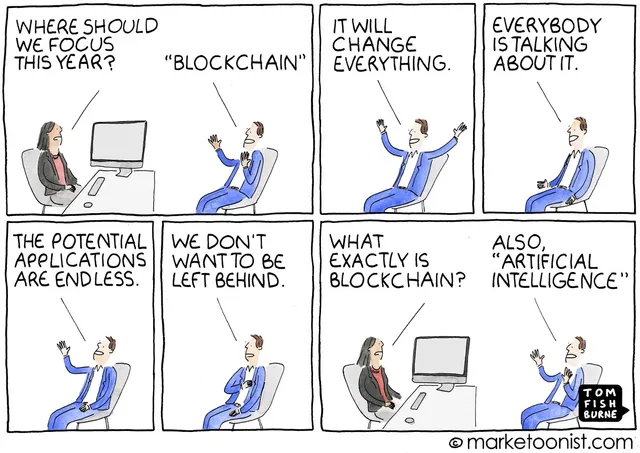

# Index 

- [No Plan Survives Contact With the Enemy](#No-Plan-Survives-Contact-With-the-Enemy)
- [Reality Check](#Reality-Check)
- [I Want to Be Data Driven When I Grow Up](#I-Want-to-Be-Data-Driven-When-I-Grow-Up)
- [The Problem of Siloed and Segregated Data](#The-Problem-of-Siloed-and-Segregated-Data)
- [Signal and Noise](#Signal-and-Noise)
- [Managing Expectations](#Managing-Expectations)

**Disclaimer!**

This guide is intended to alert you to possible disappointing job offers, internships, real-world project collaborations.

It is in no way intended to be representative of the work environment or the people you will meet, but **Virgilio wants you to see what the worst-case scenario would look like.**

## No Plan Survives Contact With the Enemy

**Congratulations!**

If you are reading these words, you are probably back from _months and months_ (or years) of studying through the various resources of the Purgatorio, and have familiarized yourself with most of the concepts explored, and experienced some of them on datasets found around. 

You may have built some small Data Science project on GitHub to showcase, and you started applying for some Data Science internships or positions.  

Gaining confidence from the months (or years) of **study + practice** you've done, you accept the first internship you're offered. 

_Fast forwards a few weeks:_

You're very disappointed, the job is not what you expected, not at all! 

The first day of work, your boss gives you a "dataset" that a client gave him, and asks you to get "**an AI who understands how to make them useful**" (what?!?).

The dataset has a lot of missing values, the column names are flimsy and nobody explained how to interpret them. Exploring those messy data you find that the column to predict has half the missing values, and the other columns have enough noise to make them unusable.

So this dataset, with your actual knowledge, is almost unusable!

Moreover, **the salesmen were definitely not aligned on the current possibilities of Artificial Intelligence** (as they call predictive models to sell them at higher price :D), and they promised the moon!

---

Sad and desolate you take the negative comments of your boss, who thinks that you don't know how to do anything.

What went wrong? Wasn't everything as rosy as you thought?

It's everything fine, you just need some **reality check.** 

::: tip
If you've ever had a situation like this, well, it's probably better if you move away from such a boss). 
:::

## Reality Check

For sure you've heard that [Data Scientist isThe Sexiest Job of the 21st Century](https://hbr.org/2012/10/data-scientist-the-sexiest-job-of-the-21st-century), and a lot of articles and blogs describes the Data Scientist daily job as a walk in the park, without messiness and effort.

**The inconvenient truth is completely different, and here are some reasons:**

- Most of the Scientist daily time [is related to ETL](https://www.quora.com/What-is-an-average-work-day-for-a-data-scientist) (Extract, Transform, and Load Data), not the funniest thing ever.
- Real-world datasets are almost never complete, clean, well aggregated ([Machine learning isn't Kaggle competitions](http://jvns.ca/blog/2014/06/19/machine-learning-isnt-kaggle-competitions/)).
- You don't have someone explaining how they were built or what to expect inside them (like a Kaggle "data explanation" section). 
- Often the datasets you are provided with contain a lot of noise, and it is vital to know what to discard. 
- Everyone is [expecting you to do fancy magic with data](https://www.reddit.com/r/datascience/comments/3m78k1/i_hire_data_scientists_this_is_the_stuff_this/), maybe they expect you to build a super-intelligent AI to fire employees and take over the world.

Okay, maybe the last one's a joke... or not! 

In fact, since there is a huge hype around the field of Data Science, **the expectations** of those who allocate the company budget to this topic are also very high!

See:

- [Here’s why so many data scientists are leaving their jobs](https://towardsdatascience.com/why-so-many-data-scientists-are-leaving-their-jobs-a1f0329d7ea4)

::: warning 
That **doesn't mean** you have to be discouraged, it just means you have to have the right expectations! With the right expectations and premises, the work of Data Scientist is _challenging, satisfying and creates enormous value for those who use it!_
:::

These common data-related problems are adressed in specific in the next sections.

## I Want to Be Data Driven When I Grow Up

Companies, although rational and profit-driven structures, are entities composed of humans, who are by their nature influential and emotional. This means that some of the factors that influence the decisions made in a company are totally irrational, dictated by emotions. 

One decision a company can make is to push for innovation, and *that is good!*

But it can happen that those who have to deal with innovation decisions are at best ignorant about it, and at worst reluctant to change!

So what happens? 

That often (human emotions) you get carried away by buzz-words, by themes around which there is Hype, without really understanding them or understanding if they can really bring value. 
This process often leads many organizations to want to call themselves ["data-driven"](https://www.cio.com/article/3449117/what-exactly-is-a-data-driven-organization.html), when they don't really know what it means / what it could be used for!

Often this kind of statement is also partly for advertising purposes... 

Also Relevant:

 

### **The bottom line:**

Be careful when you talk to a "data-driven" company, do they really know what they're talking about? Ask yourself, for example:

- how does data impact the business?
- is there a dedicated Data Science team?
- are they aware of the real possibilities of predictive models that exploit data?
- How much does being data-driven affect the company's marketing? 

Read this very good Reddit thread about building real data-driven businesses:

- [How to create a ‘data driven’ business?](https://www.reddit.com/r/datascience/comments/eecg2k/how_to_create_a_data_driven_business/)

- [3 Challenges Companies Face in Becoming Data Driven](https://www.europeanbusinessreview.com/3-challenges-companies-face-in-becoming-data-driven/)

- [The Top 5 Challenges of Creating a Data-Driven Culture (and How to Solve Them)](https://medium.com/@pelatum/the-top-5-challenges-of-creating-a-data-driven-culture-and-how-to-solve-them-9a2b9c1efa71)

There are various reasons why a company struggles to become really data-driven, but perhaps one of the biggest problems is that of the "silos" inside a company.

## The Problem of Siloed and Segregated Data

[Elon Musk](https://it.wikipedia.org/wiki/Elon_Musk) is unquestionably one of the smartest and most creative company CEOs on the planet, he created highly disruptive companies like [SpaceX](https://www.spacex.com/) and [Tesla](https://www.tesla.com) from scratch, and is one of the founding members of [OpenAI](https://openai.com/). 

In one of the internal communication emails he says to all his employees at Tesla:

> There are two schools of thought about how information should flow within companies. By far the most common way is chain of command, which means that you always flow communication through your manager. The problem with this approach is that, while it serves to enhance the power of the manager, it fails to serve the company.

> Instead of a problem getting solved quickly, where a person in one dept talks to a person in another dept and makes the right thing happen, people are forced to talk to their manager who talks to their manager who talks to the manager in the other dept who talks to someone on his team. Then the info has to flow back the other way again. This is incredibly dumb.

> Anyone at Tesla can and should email/talk to anyone else according to what they think is the fastest way to solve a problem for the benefit of the whole company. You can talk to your manager's manager without his permission, you can talk directly to a VP in another dept, you can talk to me, you can talk to anyone without anyone else's permission. Moreover, you should consider yourself obligated to do so until the right thing happens. The point here is not random chitchat, but rather ensuring that we execute ultra-fast and well. We obviously cannot compete with the big car companies in size, so we must do so with intelligence and agility.

> One final point is that managers **should work hard to ensure that they are not creating silos within the company that create an us vs**.

As you can see from Elon'w words, the problem of siloed companies is a well-known issue, and to fight this problem have been thought best practices. In fact a siloed company this brings with it only disadvantages, of which we are interested in those related to data:

- data is collected, organized and stored in a _non-homogeneous way_. 
- data can _overlap and create confusion._
- you can't create truly objective and _comparable business metrics_.
- to use data in an "intelligent" way and gain insights from it is very difficult, because you have to _unify different data sources_ (one business unit stores everything in Excel files, another in an SQL Database, another in an online platform... and so on).

To learn more about how siloed data (that arise from a "siloed" company) take a read of the following links: 

- [What are Data Silos?](https://www.talend.com/resources/what-are-data-silos/)
- [What is a Data Silo and Why is It Bad for Your Organization?](https://www.plixer.com/blog/data-silo-what-is-it-why-is-it-bad/) 
- [Siloed Data is Killing Your Business Analytics](https://www.cyfe.com/blog/siloed-data-is-a-destroyer/)

How to solve the siloed-data situation: 

- [Data Silos: What They Are and How to Get Rid of Them](https://blog.hubspot.com/service/data-silos)
- [How To Breakdown Data Silos: Problems and Solutions](https://status.net/articles/data-silos-information-silos/)

## Signal and Noise
## Managing Expectations

