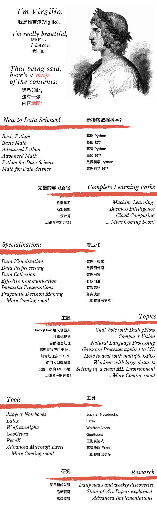

## 这是什么地方？

通过互联网进行学习意味着在无限的混乱信息丛林中游泳，在快速变化的创新领域更是如此。

当你试图接近一个没有真正 “路径” 的新主题时，你有没有感到不知所措？是否难以获得深厚的知识和应用它的能力？

嗨，我是 [维吉尔(Virgilio)](https://zh.wikipedia.org/wiki/%E7%BB%B4%E5%90%89%E5%B0%94) 。

就像几年前我和 但丁(Dante) 一样，在你的互联网旅程中，我将成为你的导师和参考点，为你提供完整的有机学习途径，包括多个领域，工具，技能等。

## 我是怎么做到的？

我试图简明扼要，以避免信息开销。

我按层次结构和复杂程度组织了内容，以便你对事物的运作方式有一个连贯的认识。

你将学习如何通过实践项目理解和应用理论，并仔细遵循我的提示和技巧，你将从头开始掌握新技能。

在此之前，你不需要拥有这些主题的任何相关知识，但是你要对自己的编程能力和高中数学有信心，以便理解和实现这其中的大多数概念。

此处列出的每个资源都是免费或开源的。

我最感兴趣的是数据科学，因为我曾试图预测耶路撒冷的陨落，但是你知道，当时我们没有那么强大的计算能力！

## 你能在这里找到什么？

我为你打包了几种类型的指南：
- 职业：完整的学习路径，指导你从头开始掌握新技能。
- 主题：由子领域组织的特定主题、方法和现实应用的综合指南。
- 专业化：个人技能的垂直指南。
- 工具：单一工具或技术的深入指南。
- 研究：对最新论文和技术文件的最新审查和解释。
- 元(Meta)：这些主要是关于如何学习和接近新概念的指南。

如果你发现此 *repo* 有用，我请你 *star* 一下，与你的朋友和同事分享，然后点击 *watch*，因为每天都会有更新！

## 我的目的是什么？

我的目标主要是帮助人们开始接触和使用创新的领域和技术，即使你从未尝试过编写代码，或者你需要深入复习相关数学知识，我都会给你提供这样的基础。因此，你可以是一名学生、另一个领域的工作人员或经理，你将在这里找到所有你需要做的准备工作，以应对未来几年肯定会发生的具有破坏性和不可预测的市场和社会转型。

我的价格：我在这里等你，免费。如果你发现我在某种程度上有所帮助，我只要求你留下一个 *star* ，点击 *watch*，每次你有机会时请分享我。让我们开始我们的旅程！

# 新接触数据科学？
### [基础 Python](NewToDataScience/PythonBasic.md)
### 基础数学 - 即将推出
### 高级 Python - 即将推出
### 高级数学 - 即将推出
### [Python 数据科学](NewToDataScience/PythonDataScience.ipynb)
### 数学数据科学 - 即将推出

# 完整的学习路径
## [机器学习研究路径](LearningPaths/Machine%20Learning%20Engineer%20Career%20Path)
## 商业智能研究路径 - 即将推出
## 云计算研究路径 - 即将推出

# 专业化
## [数据预处理](Specializations/HardSkills/DataPreprocessing.md)
## 数据收集 [即将推出 - 下一步]
## 数据可视化 [即将推出]

## 有效沟通 [即将推出]
## [有效陈述 - **新**](Specializations/SoftSkills/ImpactfulPresentations.md)
## 实用决策 [即将推出]

# 工具
### [Latex](Tools/Latex.md)
### [Wolfram Alpha](Tools/WolframAlpha.md)
### [GeoGebra](Tools/GeoGebra.md)
### [正则表达式](Tools/Regex.ipynb)
### 即将推出

# 主题
### [DialogFlow 和 Flask 打造 ChatBot](Topics/DialogFlow.md)

# 研究
### [Zotero](Research/Zotero.md)
### [最新论文解释](Research/Papers.md)

# 关于专业化

你可以按顺序选择它们或选择最适合你的那个，但我建议你至少要一次把它们都看完。

我计划了两种类型的专业化：硬技能和软技能

前者是关于技术流程，是每个处理数据的人的核心工具包。使用数据是一种艺术形式，经验法则和最佳实践将帮助你了解处理它们的方式。你需要对如何处理数据产生一种 “感觉”，这种 “感觉” 主要是由情况和经验驱动的。因此，这些专业将强烈关注练习和实践。

后者是关于... 所有未写在技术书籍中的东西。使用和掌握它们，因为它们是你真正的价值的促成者。你可以成为世界上最好的开发人员或工程师，但如果你无法向受众传达你的建议和发现，或者使用数据来建议现实世界中的实际行动，那么你对公司来说就毫无用处。

# 关于主题

单个主题将按字段分割，它们会涉及实际应用程序，方法，技术栈，最佳实践等。

# 关于工具

“工具” 部分将提供有关你需要了解的特定技术 / 语言 / 方法的所有指南！它们将为你提供彻底探索和掌握手头工具的方法。

# [订阅我们新闻发布和更新的FACEBOOK组](https://www.facebook.com/groups/mathfordatascience/)

# 翻译人员

[@jiaxianhua](https://github.com/iOSDevLog) (iOSDevLog)
