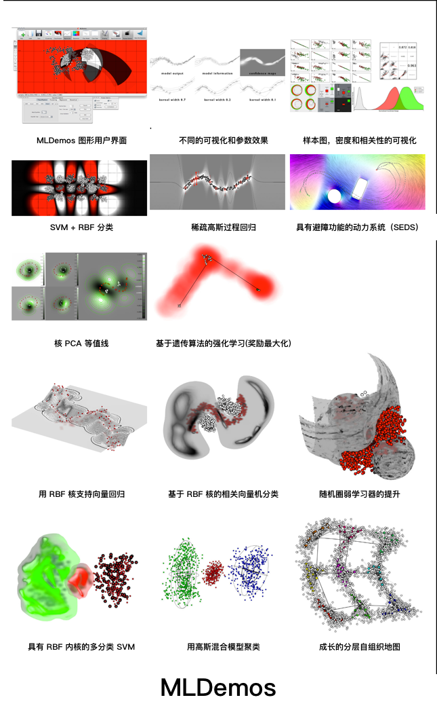

# MLDemos

[MLDemos](http://mldemos.b4silio.com/) 是一款用于机器学习算法的开源可视化工具，用于帮助研究和理解多个算法如何运作以及它们的参数如何影响和修改分类，回归，聚类，降维，动态系统和强化学习(奖励最大化)等问题的结果。

MLDemos 是开源的，可供个人和学术用途免费使用。

由 Basilio Noris 博士在 [LASA实验室创建](http://lasa.epfl.ch/)，该计划的开发得到了以下组织和团体的支持和帮助。


## 安装

### 二进制包：

[MLDemos 0.5.2 for Windows](http://mldemos.b4silio.com/MLDemos-Windows-20180912.zip)

最低要求：XP SP3

[MLDemos 0.5.2 for Mac](http://mldemos.b4silio.com/MLDemos.dmg)

最低要求：Snow Leopard

[MLDemos 0.3.2_CDE](http://mldemos.b4silio.com/MLDemos-0.3.2-cde.tar.bz2)

最低要求：内核 2.6.X

感谢 Philip Guo（[网站](http://www.pgbovine.net/cde.html)）

### 合法性

这些包包含许多开源库的二进制版本。我将它们包括在这里，并且知道这可能与每个相应库的分发策略不完全兼容。我将尝试联系并从相关方获得必要的许可，在可能的范围内。与此同时，我真诚地宣传这个软件，让人们能够学习理解和使用这里提到的众多方法。请参阅致谢部分，向贡献人员表示由衷的感谢。

你可以将此软件用于个人和教育目的，但是你不得将其用于商业目的。只要你提供此页面的链接，就可以重新分发软件。然后，此页面将始终链接到最新版本的软件，因此你最好还是在这里使用该版本。

### 源代码：

MLDemos 源代码可以直接通过 git 或公共仓库获取（获取最新版本的 *devel* 分支）

```sh
git clone git：//gitorious.org/mldemos/mldemos.git -b devel
```

[GitHub  公开仓库](https://github.com/b4silio/MLDemos)

[源码备份](http://mldemos.b4silio.com/MLDemos-0.3.0-source.zip) （0.3.0）

#### **必要条件**

该代码需要 Qt（5.10）和（部分）OpenCV（3.1）和 Boost（1.47）。这些库的早期版本可能也可以正常工作，但你也可以使用较新的版本。请务必调整 include 和 lib 路径以将它们指向正确的目录。

该软件使用 QtCreator 2.1 和 2.6 在 Mac OSX High Sierra，Windows 10，Gentoo，Ubuntu 和 Kubuntu 10.04 上进行编译和测试。

* Windows

为了在 Windows 中编译 MLDemos，你需要 MinGW（通常安装 QGSDK 自带 MinGW)

* Debian

Barak A. Pearlmutter 教授创建了一个 debian 软件包，很快就会推出。同时你可以建立它下面的说明：

```sh
git clone git://github.com/barak/mldemos.git
cd mldemos
git checkout debian
dpkg-checkbuilddeps
fakeroot debian/rules binary
sudo dpkg --install ../mldemos_*.deb
```

> 注意：OpenCV 2.4 不能直接使用（仅 2.1），这将要求你构建 OpenCV2.4。这只是使用 MLP 和 Boosting 所必需的。这是两个重要的算法，所以你最好努力一下：

```sh
git clone git://github.com/barak/opencv.git
cd opencv
git checkout master
dpkg-checkbuilddeps
fakeroot debian/rules binary
sudo dpkg --install ../*opencv*.deb
```

再次，非常感谢 Barak ！

### **已知 bug**

* WINDOWS：在 3D 显示中清除画布会留下占用的部分内存，这可能会在多次完成时累积（仅限 Windows 上的内存错误的一部分）
* LINUX（CDE 包）加载和保存外部文件不起作用
* 近似最邻近 KNN 分类在某些机器上创建了并带有一些指标的奇怪空白区域，。
* 保存在 Linux CDE 包上不起作用
* 在绘制奖励地图时调整画布大小不会更新基础数据（避免这样做）。
* 在 Boosting 中，更改数据不会重新计算学习器，如果数据显着改变了边界，则可能导致不良结果

### **新功能**

[Changelog](http://mldemos.b4silio.com/changelog.txt)

v0.5.0

#### *新的可视化和数据集功能*

* *添加了样本的三维可视化和分类，回归及最大化结果*
* *添加了可视化面板，其中包含各个图，相关性，密度等*
* *添加了编辑工具来拖动 / 磁化数据，更改类，增加或减少数据集的尺寸*
* *添加了分类维度（带有非数值的索引维度）*
* *添加了 “数据集编辑” 面板以交换，删除和重命名维，类或分类值*
* *用于显示，导入 / **导出** 数据，分类性能的 几个错误修复*

### *新的算法和方法*

* *添加了 “网格搜索” 面板，用于批量测试一次最多两个参数的值范围*

* *为非多类算法添加了 One-vs-All 多类别分类*

* *现在可以对新数据进行训练和测试（对一个数据集进行训练，对另一个进行测试）*

* *添加了 RBF 内核的 SVM 自动相关性确定（感谢 Ashwini Shukla！）*

* *添加了成长的分层自组织地图（Michael Dittenbach 的原始代码）*

* *添加了随机森林分类*

* *添加 LDA 作为分类器（除投影仪外）*

* *为 GMM 和 SVM 添加了保存 / 加载模型选项*

## 软件截图 (说明在图下方)



## 算法

### 实现方法

#### 分类

* 支持向量机（SVM） （C，nu，Pegasos）
* 相关向量机（RVM）
* 高斯混合模型（GMM）
* 多层感知机 + 后向传播
* 温柔的 AdaBoost + 朴素贝叶斯
* 近似 K-Nearest Neighbors（KNN）
* 高斯过程分类（GP）
* 随机森林

#### 回归

* 支持向量回归（SVR）
* 相关向量回归（RVR）
* 高斯混合回归（GMR）
* MLP + BackProp
* 近似 KNN
* 高斯过程回归（GPR）
* 稀疏优化高斯过程（SOGP）
* 局部加权散点图平滑（LOWESS）
* 局部加权投影回归（LWPR）

#### 动力系统

* GMM + GMR
* LWPR
* SVR
* SEDS
* SOGP（慢！）
* MLP
* KNN
* 增强型 SVM（ASVM）

#### 聚类

* K 均值(K-Means)
* Soft K-Means
* Kernel K-Means
* K-Means++
* GMM
* One Class SVM
* FLAME
* DBSCAN

#### 预测

* 主成分分析（PCA）
* 内核 PCA
* 独立成分分析（ICA）
* 典型相关分析（CCA）
* 线性判别分析（LDA）
* Fisher 线性判别
* EigenFaces 到 2D（使用 PCA）

#### 奖励最大化 （强化学习）

* 随机搜索
* 随机漫步
* PoWER
* 遗传算法（GA）
* 粒子群优化算法
* 粒子滤波器
* Donut（一种基于变分自动编码器的季节性 KPI 的无监督异常检测算法）
* 无梯度方法（nlopt）

### 贡献

如果你正在开发一种适合 MLDemos 框架的新算法，并希望将其集成到软件中，请与我们联系（参见下面的信息）并描述实现 MLDemos 插件所需的帮助类型。

### 致谢

如果许多人没有投入大量精力来实现这里组合成单个程序的不同算法，那么该程序将不存在。

* Florent D'Hallouin (GMM + GMR) - [LASA](http://lasa.epfl.ch/)
* Dan Grollman (SOGP) - [LASA](http://lasa.epfl.ch/)
* Mohammad Khansari (SEDS + DSAvoid) - [LASA](http://lasa.epfl.ch/)
* Ashwini Shukla (ASVM, ARD Kernels) - [LASA](http://lasa.epfl.ch/)
* Stephane Magnenat (ESMLR) - [website](http://stephane.magnenat.net/)
* Chih-Chung Chang and Chih-Jen Lin (libSVM) - [website](http://www.csie.ntu.edu.tw/~cjlin/libsvm/)
* David Mount and Sunik Arya (ANN library) - [website](http://www.cs.umd.edu/~mount/ANN/)
* Davis E. King (DLIB) - [website](http://dlib.net/)
* Stefan Klanke and Sethu Vijayakumar (LWPR) - [website](http://www.ipab.inf.ed.ac.uk/slmc/software/lwpr/)
* Robert Davies (Newmat) - [website](http://www.robertnz.net/nm_intro.htm)
* JF Cardoso (ICA) - [website](http://www.tsi.enst.fr/icacentral/algos.html)
* Steven G. Johnson (NLOpt) - [website](http://ab-initio.mit.edu/wiki/index.php/NLopt)
* The WillowGarage crowd (OpenCV) - [website](http://opencv.org/)
* Trolltech/Nokia/Digia (Qt) - [website](http://qt.digia.com/)
* The authors of several of the icons - [website](http://www.iconeasy.com/)
* 参加 EPFL 2012 年 ML 课程的博士生（Julien Eberle，Pierre-Antoine Sondag，Guillaume deChambrier，Klas Kronander，Renaud Richardet，Raphael Ullman）
此外，如果没有 LASA 的支持和开发团队的工作，该计划本身的性能将大大降低：Christophe Paccolat，Nicolas Sommer 和 Otpal Vittoz。

还要感谢那些没有贡献代码但直接贡献的人：Aude Billard，作为人们所希望的最佳老板之一，FrançoisFleuret，进行了一系列富有成果的讨论，以及 AML 2010 和 2011 年的课程耐心地给它第一次试驾。

## 快速开始

### 极速入门

1. 启动该软件
1. 通过单击鼠标左键或右键来绘制样本。
    1. 左键单击生成 0 级样本
    1. 右键单击生成工具栏中所选类的样本（默认值：1）
1. 选择 “显示选项” 图标
    1. 这将允许你显示模型信息，置信度 / 似然图并隐藏原始样本
    1. 鼠标滚轮将允许你放大和缩小
    1. alt + 拖动将允许你平移空间
1. 选择 “算法选项” 图标
1. 选择一个算法图标以打开其各自的选项面板
1. 单击 “分类” 按钮以对当前数据运行算法

### 导入数据

在 MLDemos 中生成数据有三种不同的方式：手动绘制样本，通过 PCA（通过 PCAFaces 插件）投影图像数据，或通过加载外部数据。
可以将逗号分隔值或其它基于文本文件的值表拖放到界面中。在这种情况下，将出现 “数据加载” 对话框，允许选择应加载哪些列或行，解释为类标签或标题等。

或者，软件使用的本机数据格式是基于 ascii 的，包含：

1. 维度# 后跟着是样本数量#
1. 对于每个样品，一行包含
    1. 样本值以空格分隔（浮点数，每个维度一个）
    1. 样本类索引（整数 0 ... 255）
    1. 用于终止该行的标志值（整数 0-3）（暂时未使用）

一个简单的例子是

```code
4 3
0.10 0.11 0.12 0 0
0.14 0.91 0.11 0 0
0.43 0.74 0.41 1 0
0.28 0.34 0.33 1 0
```

它提供 4 个三维样本，两个来自类别 0，1 个来自类别 1 。(原文有问题吧？)

文件保存时从 MLDemos，该软件添加了当前的算法参数（假设选择了算法），这可用于演示目的。如果不存在此类信息，则选择默认算法参数。

手动绘制一些样本，或导入标准数据集并从 MLDemos 中保存它应该为你提供有关文件语法的大量示例。

网站: <http://mldemos.b4silio.com/>

------------
由 Dr. Basilio Noris 在 [Learning Algorithms and Systems Laboratory](http://lasa.epfl.ch/) 创作。

由 贾献华 [iOSDevLog Blog](http://iosdevlog.com/), [jiaxianhua](https://github.com/iOSDevLog) 翻译整理，陶天立[@TaoTianli](https://github.com/taotianli)校对。