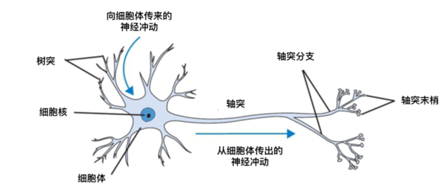
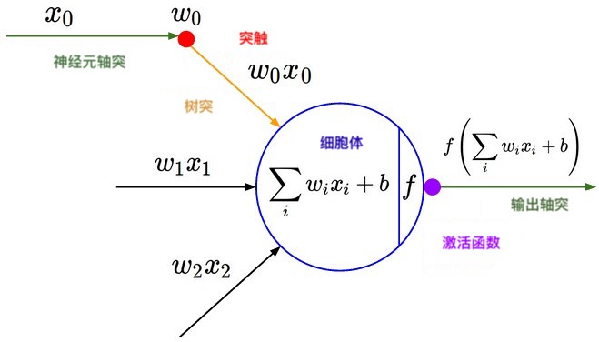
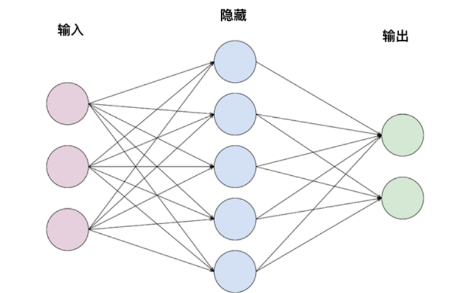

### 深度学习

为了处理极其复杂的问题，例如图像的识别或对人类语言的理解，大概已知功能的数学模型通常是不够的（欠拟合问题）。

Igor Aizenberg 及其同事在 2000 年讨论人工神经网络（ANN）时首次使用了 “深度学习” 这一表达，尽管已经在 20 世纪 70 年代设计了人工神经元表示的原型，但在实践中受过训练并具有重大限制：它们需要（大量的）计算能力。

术语深度学习意味着使用神经网络 (我们很快就会看到他们是什么)， 具有不同的深度 "级别"， 因此被称为 "深度"。

在过去几年中，它们变得越来越重要，因为它们可以管理极其复杂的任务，例如视频分类（逐帧），照片中对象的识别，在多种语言中对人类语言的理解。

大型平台（亚马逊，Netflix，谷歌，LinkedIn ......）的每个用户定制系统周六都在巨大的深度神经网络（甚至数千万个参数）上，可以处理所有复杂性。例如，Netflix 目录，包含成千上万的标题，并试图基于它以前见过的一切，它最近看到的，一天中的时间或许多其它因素找出哪个最适合用户！

### 神经网络

## 介绍和与生物学的联系

什么是神经网络？神经网络是 ML 系统（通常是深度学习子模块）的一个组成部分，它具有大量参数（称为权重），这些参数在训练过程中逐步调整，试图有效地表示它们处理的数据，因此你可以很好地泛化将要呈现给你的新案例。

它之所以被这样称呼是因为它模仿生物大脑的结构，其中神经元通过突触交换电化学冲动，从而产生外部世界在我们脑海中刺激的表征和思想。

例如， 如果我们看到马的图像， 视觉神经元 (放置在大脑皮层部分的一种特殊类型的神经元称为视觉皮层) 就会被激活， 并根据在我们的记忆中连接到应该是 "我看到一匹马"。

即使我们把目光移开，在短期内我们也非常清楚我们刚刚看到的图像，这是因为神经元和突触不断与记忆和先前的经验合作，为我们提供了逼真而稳固的感知。

神经元工作所依据的模式大多是我们无法理解的模式， 即使我们看到神经生物学家和各种横向领域每天都在朝着这个方向努力。

在成长过程中，由于我们生活的感官体验（个体神经可塑性的概念，允许我们的身体在整个生命中建立神经元和连接），个体的大脑会发展并发展它的联系。

每次我们有感官体验或学习新东西（比如把我们的鞋子当作孩子），我们的大脑会加强神经元的一部分，特别是它们的联系。

从某种意义上说， 想要稍微强迫生物类推， 它可能是有益的想象， 我们已经实现了这一刻的所有经验 (视觉， 触觉， 情感...) 作为一个巨大的 "训练集"， 我们的网络在大脑中的神经元被塑造，不断变化， 试图以最明智的方式表示现实， 让我们做出以个人的安全为目标 (和成功的繁殖) 有意识的选择。

例如，当我们第一次作为孩子与火相互作用并且我们被烧毁时，我们可以说通过极其简化，这发生在一个高层次：

1. 我们的大脑完成了 “我认出火” - >“我用手指触碰它” 的序列。
2. 事件被 “标记” 为坏（我们感到痛苦）。
3. 大脑将这两条信息（一个数据及其标记）作为输入，并试图了解当我识别火时激活了哪些神经元序列。
4. 大脑 “更新” 其结构（构建新神经元，突触和肿胀现有神经元）以改善并学习不要重复此动作。尽可能地简化，就好像大脑将 “烧伤” 的概念 “链接” 到“我看到火”的序列 -> “我用我的皮肤触碰它”。
5. 下一次大脑看到火时，大脑设置为 “学会不烧伤” 的一系列神经元被激活，并通过与杏仁核（我们的记忆所在的位置）合作，它将我们从新的危险中拯救出来。

## 单神经元作为分类器

我们刚刚看到的过程（学习不触碰火）包含一些启发了当今使用的神经网络设计的关键元素。
我们将在接下来的章节中看到人工神经网络如何将标记数据（我们称之为 “facts”）作为输入，试图了解每个神经元如何权衡正确或不正确的分类尝试，并试图 “拍摄快照”，稍后，稍微修改它们。

人工神经元如下构成：它们具有中心 “体”（由数字表示），输出激活函数“决定” 该神经元是否将与其连接的神经元（或将自身激活）通信，以及来自其它神经元的一系列输入，这些输入不时地促成个体神经元的激活与否。

然后，人工神经元将一系列输入（之前神经元的输出）作为输入，将这些值相加并将它们与其当前值组合，如果此计算达到某个阈值，则激活神经元，将其激活函数应用于计算刚刚制造并向前传播到它的 “下层” 神经元。

我们可以想象，如果其输入的总和大于 0.5，则激活函数“向前传递”（前馈传递），否则它不会这样做。
在这种情况下，我们可以训练神经元接受输入并根据它是否有效（二分类）在两种不同的情况下对其进行分类。

在图像中：x0 是从另一个神经元接收的输入，w0 是该神经元与当前神经元之间的连接。
F 是神经元的激活函数（实践中有好几种），如果它达到所选的激活阈值，则应用于神经元的内部计算。
为了对 “激活阈值” 的概念进行编码，我们使用一个称为偏置的数字作为偏移量，将其添加到激活计算中（图像中的 b）。

## 神经网络简介

在实践中，单个人工神经元在解决问题方面毫无用处，因为它太简单了。

但是通过将该神经元的许多副本构造成层级，可以创建复杂的结构，例如，能够捕获图像的复杂性并对其进行分类。

术语神经网络是指在非循环图中连接在一起的一系列神经元，组织成层。

最基本的层由一定数量的神经元组成，这些神经元连接到下一层的所有神经元（但不连接到同一层上的神经元），并称为全连接层。
除输入和输出之外至少有一层的神经网络称为深度神经网络，其中隐藏层是内部层。

在图像中，网络具有包含 3 个神经元的输入层，4 的隐藏层和 2 个输出层（二分类）。

在这种情况下，网络在不计算输入的情况下，[3 x 5] + [5 x 2] + 5（隐藏偏置）+ 2（输出偏置）= 27 个可修改的参数。
具有数亿个参数的现代网络以大约 15-25 个级别组织。

用于多层神经网络的另一个名称是 MPL（多层感知机）。
这种神经网络称为前馈神经网络，因为数据只是 “向前” 传播。

还有其它类型的网络（RNN），其神经元反而多次看到相同数据的通过，并实现网络 “记忆” 的概念。
这些被广泛用于识别人类语言，其中主语从一个句子变为一个句子，但是上下文通常保持相同，并且必须在解释新句子时被网络“记住”。

希望你现在熟悉人工神经网络的概念。
在下一个高级指南中，我们将了解如何构建和训练此类网络以解决分类问题。

如果你喜欢 Virgil 的内容并分享我们所有人都可以访问的开放式教育愿景，请在 Google 表格中分享和注册，每当新指南出来时你都会得到更新！

------------------

由 _clone95_ 撰写