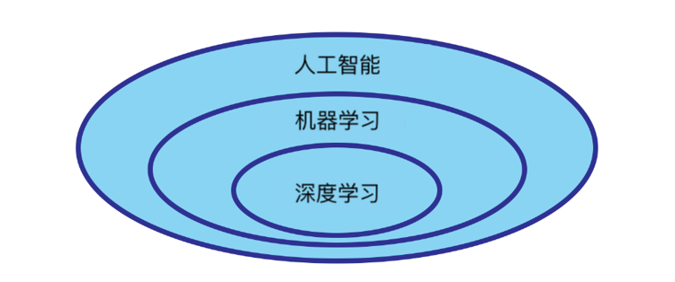

## 什么是人工智能，机器学习和深度学习

有了这个高级指南，我想澄清有关术语的想法，这些术语涉及人工智能和机器学习等术语以及它们的应用和潜力。您还将了解 [行话](https://zh.wikipedia.org/wiki/%E8%A1%8C%E8%A9%B1) 这些令人难以置信的主题在不断演变中。您将了解读取 AI 或机器学习的任何新闻或事实的层次结构和上下文。

术语 *机器学习* 经常与术语 *人工智能（AI）* 混淆，后者指的是一组技术，方法和算法，包括机器学习（缩写为 ML）。 AI 领域的目标是创建 “智能” 代理，通过传感器可以感知现实世界，通过 “智能” 做出决策，最后通过执行器实现它们。
如果你想与人类进行类比，你可以将传感器视为感觉器官（眼睛，耳朵......），智能就是我们大脑的智能，执行器可以是手，脚或更一般的肌肉。
然而，生物类比是有限的，因为代理的传感器不必检测物理现象，例如温度或时间，但它可以检测任何其他类型的数据，关系或输入。
机器学习通常被认为是 AI 领域的子集。具体来说，术语 *机器学习* 意味着对机器进行编程的科学，以便它可以学习从数据中执行任务，而非通过编程实现。
深度学习是机器学习领域的一个子集，是利用神经网络解决诸如计算机视觉或自然语言处理等问题的技术和算法的进一步集合。

## 定义

Tom Mitchell 给出了机器学习的更工程的定义：
> “对于某类任务 T 和性能度量 P，如果一个计算机程序在 T 上以 P 衡量的性能随着经验 E 而自我完善，那么我们称这个计算机程序在从经验 E 学习。” 

这种理论分类在实践中可能难以区分，但是通过一个例子，例如新一代汽车的自动驾驶系统，它变得更加清晰。
事实上，这可以被视为一个整体的人工智能系统：它通过传感器从现实世界（道路，汽车，路标，速度）收集数据，拥有一套构成其智能的行为 “规则”（“如果您要与物体碰撞，则可以预防性地制动”) 并拥有一套执行器，通过它们执行决策（制动，转向，ABS）。
在这个例子中, 汽车的 AI 系统有一个机器学习的子模块, 允许它随着时间的推移而改进, 因为汽车 "看到" 不同的道路和情况,并与某些指标 (安全、制动反应时间、消耗) 相比, 提高了性能。
这个机器学习模块由更多的子模块组成，其中可以有一个深度学习模块，通过经过训练识别道路路径的神经网络，专门处理汽车对现实世界的看法。汽车的形状，区别于树木和行人，等等。

## 机器学习与算法的差异

在计算机科学中，解决问题的经典方法在于设计一个过程（算法），然后用编程语言（implementation）实现，从而以确定的方式解决问题。可以通过有意识地解释算法的每个步骤并理解在每个步骤采取的动作以及原因来识别该确定性。重要的是要注意，我不需要输入数据的示例来产生被认为是正确的输出。

机器学习的方法，在直观的层面上，包括 “看到” 许多输入示例，每个输入示例与认为正确的输出匹配，并对机器编程以检测数据中出现的重复模式。然后，如果提供了新的输入（以前从未见过），这些模式将被机器用作 “知识库”，以尝试返回正确的输出。 “训练” 机器的过程称为训练，其结果是一个模型（一组参数被正确 “调整”，以便它们识别出我们对给定问题感兴趣的模式）。获得模型后，可以使用它将正确的输出分配给它从未“看到” 的输入。因为它自发地产生思考，对于一个模型来说，它决定了从它所训练的例子开始概括的能力，否则，它需要看到可以在输入中呈现给它的每个可能的输入！

让我们看一下机器学习如何应用于现实世界的一些实际例子。

它是机器学习的一个应用：

- “智能” 垃圾邮件过滤器，它处理的垃圾邮件越多，识别和区分有用的电子邮件就越有效。

- 手绘人物或符号的识别器，如数字，字母或图形。

- 基于您已经看过的内容建议的内容定制系统（Netflix 建议观看的下一部电影，Facebook 建议您可能感兴趣的群组，亚马逊展示通常一起购买的产品）。

- 情感分析系统，能够从推文或人类产生的关于特定事件或角色的其他数据中提取重要信息。
例如，您可以在选举期间对 “唐纳德·特朗普” 概念进行情感分析，并了解发布推文的人如何看待它（消极，积极，中立......）。

- 一种写作辅助的系统，在文本编写时，预见下一个词并建议它们。此系统的示例非常受欢迎，例如智能手机自动完成或 Facebook 搜索栏。

- 计算机视觉系统，通过使用传感器（通常是摄像机）“观察” 汽车来识别汽车的型号和品牌。

我们也看到一些反例。

它不是机器学习应用程序：

- 基于关键字的搜索引擎：它不会随着经验而提高，并且为了使其更 “智能”，您必须明确地对其进行编程。

- 客户服务界面，具有针对特定需求的预编程响应。例如，如果我在客户的请求消息中检测到 “ORDER” 字样和字母数字代码，那么我将显示该代码标识的货件的状态。

- 为检测车牌号的传感器编程（例如 Safety Tutor 系统）。虽然它 “看到” 牌照并且因此可能与计算机视觉的概念混淆，但它并没有随着经验而改善，并且其性能完全取决于其在设计阶段的编程，其中它被明确校准以检测标准物体（牌照）。

- 著名的移动应用程序 Akinator，它试图猜测用户正在考虑哪个历史或电影角色。通过一系列有针对性的问题（他有头发吗？他是外星人吗？出现在星球大战中吗？）他探索了一个人物数据库，通过排除问题，他得出了答案。虽然它看起来像是一个 “智能” 程序，但实际上并不是这样：它不会通过改进经验来学习，而不是通过编程来实现，而是遵循一个人类容易解释的确定性过程。

## 为什么要使用机器学习技术？

想象一下，必须使用传统的编程技术创建垃圾邮件过滤器：

1. 首先，我们将尝试了解典型的垃圾邮件电子邮件的外观。我们可能会注意到一些单词或短语（例如 “For Yourself”，“Occasion”，“Free for for today！”）往往会出现在恼人的垃圾邮件中。
也许我们可以注意到邮件其他部分的更多模式，例如代表发件人邮箱的字符串，或者几天内从同一邮箱收到的几封电子邮件。

2. 我们会编写一个算法来检测我们注意到的这些模式，例如使用正则表达式来检测 “可疑” 单词的序列，算法会将包含许多这些模式的电子邮件报告为垃圾邮件。

3. 我们将测试该程序并重复步骤 1 和 2，直到我们得到一个令人满意的版本，可以非常准确地发出恶意电子邮件的信号。

从任务不是微不足道的那一刻起，那些创建垃圾邮件的人每天都会重新发明自己以逃避对过滤器的控制（例如，愚弄 Gmail 的 ML 反垃圾邮件模型），该程序很快就会变得巨大一套复杂的 “硬编码” 规则，混乱而且很难维护。然而，它的主要限制是，要日复一日地保持有效，必须每天更新，并且必须手动添加规则的规则！

相反，由机器学习模型组成的垃圾邮件过滤器会自动了解哪些句子，单词和模式是垃圾邮件危险的有效指标，每次识别新的垃圾邮件时都会更新自己。该程序更短，易于维护和准确识别。

总之，机器学习技术适用于：

- 流动环境，问题不断变化并且以不可预测的方式发生变化（以前从未 “看过” 的山路，包含从未遇到的单词的电子邮件，网站中用户峰值中的未知模式）。

- 复杂的问题，传统的方法是不切实际的，或者导致代码的 “科学怪人” 具有高维护成本。机器学习方法可以大大简化代码并实现更好的性能。

- 获取有关复杂问题的信息，并通过大量数据发现模式。

现在，您应该对 AI 和 ML 概念的高级概念更加自如，每次看到一个术语时，您都会知道如何对它进行语境化。
您还将看到这些术语是如何被削弱和滥用的，也许您可​​以向下一个人推荐本指南以阐明他的想法！
如果您喜欢 Virgil 的内容并分享我们所有人都可以访问的开放式教育愿景，请在 Google 表格中分享和注册，每当新指南出来时您都会得到更新！

------------------

由 _clone95_ 撰写