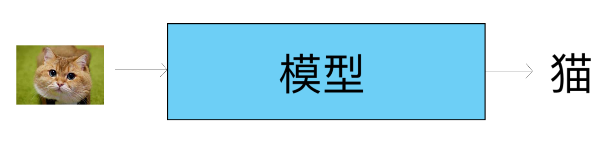
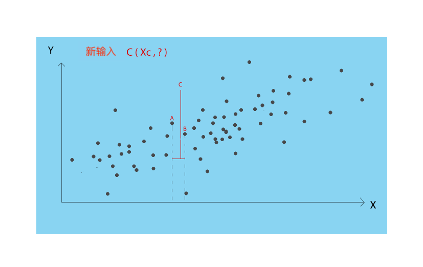
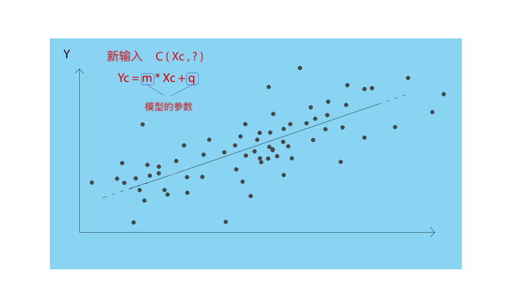
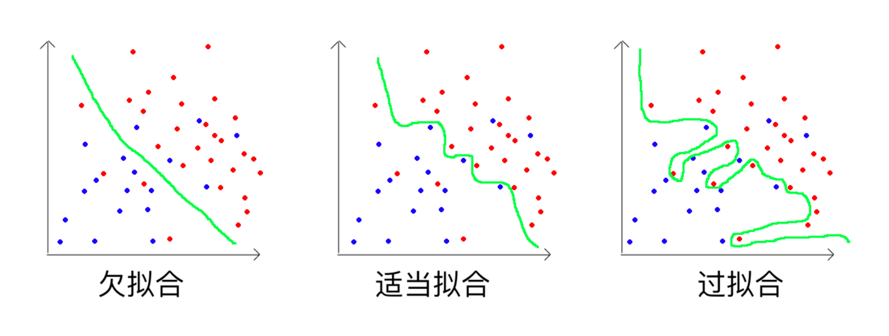

## 机器学习系统

以下段落旨在更详细地介绍 ML 系统如何呈现自身以及当今与现实世界中的应用程序开发相关的主要挑战。

## ML 系统的类型

ML 系统主要有三类：

- 监督模式（监督，无监督，强化学习）

- 学习模式（在线学习，批量学习）

- 推理类型（基于实例，基于模型）

这些标准不是相互排斥的，可以根据场景的需要进行组合：自动驾驶机器可以利用 ML 监督学习系统，通过批量学习学习，并通过统计模型 “思考” 允许它做出短期预测（“前面的机器正在制动，我很快就会激活制动器”）。

#### 监督：

最常见的学习模式是 **监督学习**。它包括通过包含所需解决方案的数据来训练系统：这些解决方案称为标记。
“标记” 数据的示例可以是具有所分配的汽车模型（标记）的汽车图像（实际数据）。
一旦 ML 系统接受了数据及其标记的训练，系统就可以输入新的图像并输出其（假定的）标记！在分配正确的标记时衡量系统 “技能” 的指标是多种多样的，将在不同的指南中进行更详细的检查。

可以通过监督学习解决的两个最常见的任务是分类和回归。 **分类** 问题包括为新输入分配离散标记。它可以是数值或类别（例如，如果它代表狗或猫，则给出图片），但无论如何，它包含在明确定义的选项集中。

**回归** 的问题在于为新数据分配连续值，例如给定一年中某个时刻的温度（显然，温度是指定值，由于实际原因是有限的，例如 29.34° ，但回归的想法是输出包含在连续的区间而不是有限的集合中。

我们将用于解释基于模型的模型和基于实例的模型之间的差异的示例是回归问题的典型示例（在这种情况下是线性的，因为直线函数很好地接近我的点分布）。

但是，如果它发现模型被编程为不返回数字，而是返回一个类别？例如，它可以将价格分类为 “高”，“中”，“低”，如果在输入中我们已将此标记与数据集的每个实例相关联。预测输出标记（而不是连续值）的问题称为分类。
典型的例子是在数千只狗和猫的图像数据集上训练的模型，并学习如何分类在这两个类别之一中提供的新照片。分类模型可以学习区分任意数量的类，只要它们具有相当雄心勃勃且具有代表性的数据集！

通常，分类模型预见连续值作为属于每个输出类的给定示例的概率。概率可以解释为模型对给定示例属于每个类的置信度。通过选择具有最高概率的类的标记，可以将预测概率转换为类值。

但是，通常情况下，现实世界中收集的数据没有标记（稍后我们将看到此问题如何影响本文档中的工作）。
然而，在这种情况下，可以应用 ML 技术，其不需要知道它们上的数据正在处理什么，并且试图形成 “单独” 重要标记。这是 **无监督学习**。

例如，让我们假设我们有一个超市销售数据集，其中包含客户购买的所有商品。你可以通过将经常购买的物品分组并选择将它们放在附近的货架上来提取商业建议，或者如果你购买其它商品，则可以打折。无监督学习也被用作监督学习的补充，以探索数据（即使已经标记）并找到其它类型的未被注意的分组（从而增加我们对数据集的每个单独实例的知识量）。

**强化学习** 是完全不同的东西。在这种情况下，学习系统被称为代理，学习通过观察周围的世界（通过某种传感器），执行动作并基于某种奖励（奖励）来评估它们（良好的行动 / 不良行为）来解决问题。 。
智能体的设计旨在使其自身得到改善，调整行动中的行动参数，并争取获得更大和更大的回报。

强化学习在机器人技术中被大量使用，例如机器人通过从错误中逐渐学习来学习在周围环境中移动（通过撞击墙壁来降低奖励，而在机器人无碰撞地移动时增加奖励，鼓励它避免对象）。

#### 学习模式：

ML 系统的另一个重要特征是它们可以在一次性（批量学习）模式或连续增量（在线学习）模式下学习。
在批量学习（也称为离线学习）的情况下，系统使用所有可用数据进行训练：它通常是一个耗时且计算量很大的过程，因此只执行一次。当你想要重新训练模型时，你必须对所有数据进行重新训练，因此最好只有在我有大量新数据时才能这样做，这实际上可以提高新模型的性能（这将是接受新旧的培训。
幸运的是，这种训练方法可以很容易地自动化，因此你可以决定训练模型，例如，每晚或每周。但是，如果你需要更快的系统来应对变化（例如，检测商业欺诈或网络攻击的症状），最好的解决方案是在线学习。
在在线学习（也称为实时学习）的情况下，通过将称为小批量的小批量数据作为输入来顺序地训练系统。从新数据中学习是便宜的（在计算方面）并且快速，并且系统在收集时从即时数据中学习。
在需要反应系统响应或计算能力较弱的情况下，在线学习是最佳选择。请注意，术语 “在线” 并不意味着系统必须连接到地理网络，而只是连接到提供连续数据流的传感器。

#### 推理类型：

对 ML 系统进行分类的最后一种方法是如何推理。
基于模型的系统旨在创建知识表示（模型），然后用于生成输出。基于实例的系统不会从看不见的输入中推理，而是将其与所有先前的数据（保存在存储器中）进行比较，并在它们中找到其 “理想排列”，即它们试图将数据放置在正确的点上。一个例子对于理解这种差异非常有用。

**场景：**

给定一系列坐标（数据：X，Y）构成我们的 “知识” ，尝试给定一个新点的 X，了解哪个 Y 是最合适的。
策略可以是将点的 X 值与已知点的值进行比较，根据距离获取最近的已知点，并将其 Y 指定给新点。

然而，这种方法非常简单，并且基于强烈的假设，即新点的位置由其最近邻居单一地确定。
系统 “通过心” 学习其知识并盲目地将其应用于新案例，应用与存储的那些相关的一些相似度（在这种情况下，相对于维度 X 的距离）。
可以用来从旧的案例开始泛化新案例的另一种方法可以是创建我所制作数据的 “表示” 或“想法”（图 4 中的灰点）并使用这个“想法” “（模型）产生新点的 Y.
因此，模型是一组参数，如果适当调整，在给定新点的 X 的情况下，可以给出 Y 的良好估计。在我们的例子中，我们想象我们的模型是最接近灰色系列的直线。我们的参数是线的斜率和截距，模型的训练过程包括理解这两个参数的数值是什么。

机器学习模型，这里是最简单的版本（两个参数），有时由数万甚至数百万个参数组成。为了训练它们，并因此找到参数的 “好的值”，需要大量的计算能力，并且训练模型的过程的优化是一个由衷的和紧迫的研究课题。

## 机器学习的主要挑战

### 数据量不足

机器学习的关键假设是，你拥有训练模型所需的数据，并在以后使用它们来解决问题。
可能会发生这样的情况：在现实世界中，你拥有的数据不足以训练模型以准确识别可能对问题有意义的模式。
即使对于简单的问题，也需要数千个示例，并且对于诸如图像识别或语音识别的复杂问题，可能需要数百万个示例。

各种组织正在努力创建开放数据平台以共享数据集，并允许开发其它无法实现的应用程序。
标记问题（监督学习的标记数据）至关重要。 CloudFactory 或 AWS Mechanical Turk 等服务旨在通过将需要劳动力的组织与标记数据以及员工本身联系起来来满足这一需求。此类服务具有某些限制，例如标记的准确性和执行标记所需的时间。

### 低质量和无代表性的数据

用于训练模型的数据的另一个常见问题是它们的质量差。丢失，格式不正确甚至不正确的数据对于机器学习项目来说可能是致命的。理想情况下，应直接生成高质量的数据，但项目通常是在现有（和低质量）数据上启动的。
因此，开发 ML 应用程序的最重要（也是耗时！）步骤之一是数据预处理。预处理数据包括清理数据并为我们必须训练的机器学习模型做好准备：我们删除单个损坏的示例，我们调整字符串的格式并管理缺失的字段（缺失值）。预处理阶段完全依赖于上下文，可以采用非常不同的形式。
在这个阶段，我们通常会尝试增加我们使用的数据集的大小：例如，如果我们有一个图像数据集，我们可以考虑将每个图像的副本添加到数据集中，但是在旋转 90° 的版本中，或被某种噪音模糊。这种称为数据增强的技术对于提高应用程序的稳健性特别有用（因为模型经过训练可以看到损坏 / 失真的图像并且无论如何都能识别它们），但通常不添加 “新信息”，这只能是用额外的数据实现。
通常，你也可能遇到不具代表性的数据：一个模型，为了有效地泛化，必须看到涵盖大多数情况的各种案例（数据），并以现实的方式表现现实。
例如，让我们考虑一年中不同日期收集的温度数据集。任务是预测一年中的温度。如果我们只有 11 月的温度，模型如何发现 4 月的温度模式？更糟糕的是，如果特定的十一月特别热，因此没有代表性，我们冒险得到一个模型，做出误导性的预测！
考虑一个暗示事实，即随机模型（例如，在 [temp.MIN - temp.MAX] 范围内生成随机数）可以轻松获得比在不具代表性的数据上训练的模型更好的性能！

### 欠拟合

当我们选择的模型过于简单（几个参数）以有效地表示数据集的泛化时，就会发生欠拟合问题，因此无法捕获数据中出现的模式。例如，如果我们想使用线性模型对狗和猫的图像进行分类，我们可能会得到不可接受的表现，因为线性模型无法捕捉我们训练它的数据的复杂性。通常，欠拟合的解决方案在于尝试训练更复杂的模型（例如神经网络，其甚至可以具有数百万个参数），这可以 “考虑” 所有可能在选择中具有权重的变量输出。例如，在 64 x 64 像素的图像中，有 4096 个可能的点会影响结果！参数很少的模型很难处理这种复杂性。

### 过拟合

过拟合的概念发生在与刚刚解释的相反的情况下，即当模型对于所分配的任务看起来 “太复杂” 时。例如，以房屋价格为例训练神经网络将是无效的，因为网络将很好地学习来表示数据集，结果模型仅仅是数据的存储！遭遇过拟合的模型不能很好地泛化，因为它不能 “分离” 它所知道的世界的唯一表示，或者它所训练的数据集。
模型的复杂性（可修改的参数数量），可用数据量和任务难度之间的权衡是模型体系结构选择背后的关键概念之一。
下图是一个图，表示三种不同的情况，如果输入的二维坐标中的一个点是红色或蓝色，则模型必须进行分类：

- 欠拟合，模型太简单（例如，线性模型）并且无法掌握数据集的复杂性
- 适当拟合，模型掌握数据如何分散注意力的一般 “想法”，这不会试图改变过多来代表每个点
- 过拟合，模型大量修改以表示每个点，因此仅 “记住” 训练数据，吃力地拟合，因此，继续泛化

希望现在你应该更加熟悉如何对 ML 系统进行分类的高级想法，你应该清楚地知道分类和回归任务是什么。

如果你喜欢 Virgil 的内容并分享我们所有人都可以访问的开放式教育愿景，请在 Google 表格中分享和注册，每当新指南出来时你都会得到更新！

------------------

由_clone95_撰写